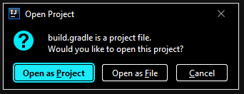
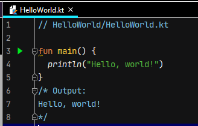
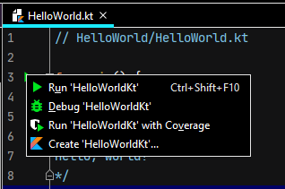
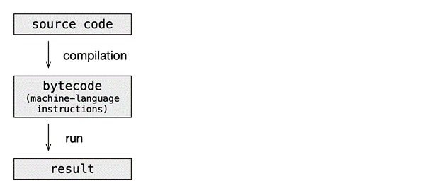

# Atomic Kotlin Examples

If you want to experiment with the code examples from the book [Atomic
Kotlin](https://www.AtomicKotlin.com), you're in the right place.

These examples are automatically extracted directly from the book. This repository
includes tests to verify that the code in the book is correct.

## Contents
- [Introduction](#introduction)
- [Compiling and Running Programs in IntelliJ IDEA](#compiling-and-running-programs-in-intellij-idea)
- [Building From the Command Line: Quick Version](#building-from-the-command-line-quick-version)
- [Building From the Command Line: Detailed Instructions](#building-from-the-command-line-detailed-instructions)
  * [Install Java](#install-java)
    + [Windows](#windows)
    + [Macintosh](#macintosh)
    + [Linux](#linux)
  * [Verify Your Installation](#verify-your-installation)
  * [Installing and Running the Book Examples](#installing-and-running-the-book-examples)
- [Compilers and Interpreters](#compilers-and-interpreters)
- [Appendix A: Command-Line Basics](#appendix-a-command-line-basics)
  * [Editors](#editors)
  * [The Shell](#the-shell)
    + [Starting a Shell](#starting-a-shell)
    + [Directories](#directories)
    + [Basic Shell Operations](#basic-shell-operations)
    + [Unpacking a Zip Archive](#unpacking-a-zip-archive)
- [Appendix B: Command-Line Hello World](#appendix-b-command-line-hello-world)
  * [Packages](#packages)
- [Appendix C: The Kotlin REPL](#appendix-c-the-kotlin-repl)
  * [Install Kotlin](#install-kotlin)
  * [The REPL](#the-repl)
- [Appendix D: Testing](#appendix-d-testing)

# Introduction

The easiest way to access and experiment with the book examples is to
clone/download this repository and open it with IntelliJ IDEA. This is all that
most people need, and those people can ignore the rest of this README.

The remainder of this README shows you how to build and test the examples using
both IntelliJ IDEA and the command line.

Exercises and solutions for the book can be found at
[AtomicKotlin.com/exercises](https://www.atomickotlin.com/exercises).

**Note**: If any terminology or processes described here are still not clear to
you, you can usually find explanations or answers through
[Google](https://www.google.com/). For more specific issues or problems, try
[StackOverflow](http://stackoverflow.com/). Sometimes you can find installation
instructions on [YouTube](https://www.youtube.com/).

# Compiling and Running Programs in IntelliJ IDEA

The easiest and fastest way to start using the examples in this book is by
compiling and running them using IntelliJ IDEA:

1. Follow the instructions [here](https://www.jetbrains.com/help/idea/installation-guide.html)
to install IntelliJ IDEA.

2. Download the [zipped code
repository](https://github.com/BruceEckel/AtomicKotlinExamples/archive/master.zip)
and [unzip it](#unpacking-a-zip-archive).

3. Start IntelliJ IDEA and select the `File | Open` menu item. Navigate to
where you unzipped the repository and open the `build.gradle` file. You should
see a dialog box like this:

    

    Select the `Open as Project` button.

4. If you don't see a `Project` window on the left side, go to the menu and select
`View | Tool Windows | Project` to turn it on.

5. You'll see an `Examples` folder. Click on it to open it, then navigate to
the `HelloWorld` folder to open that, then double-click on `HelloWorld.kt`.
You'll see something like this:

    

    Click on the green triangle in the gutter area to the left of `fun main() {`.
    It should look like this:

    

    Select the top one, the `Run` option, and IntelliJ IDEA will run your
    program and display the resulting output.

6. If you don't already have a JDK (*Java Development Kit*) on your machine,
you will see error messages. A JDK is necessary to compile both Java and
Kotlin. You can [install one from within
IntelliJ](https://www.jetbrains.com/help/idea/sdk.html#jdk-from-ide). Once the
JDK is installed, IDEA will also be able to compile Kotlin.

**NOTE**: The first program you run will take awhile, because IntelliJ IDEA is
building the entire project. Subsequent programs will start much more quickly.

# Building From the Command Line: Quick Version

Before you can run the examples from this repository, you must install the
current version of
[Java](http://www.oracle.com/technetwork/java/javase/downloads/index.html),
although some earlier versions should also work. (If you get any errors, try
upgrading to a more recent version of Java).

If you just want to download and check the code, [Download
Here](https://github.com/BruceEckel/AtomicKotlinExamples/archive/master.zip)
and [unzip it](#unpacking-a-zip-archive) into your destination directory. Open
a [shell/command window](#appendix-a-command-line-basics) and move into the
root of that directory. You'll know you are in the right directory if you see
the files `gradlew` and `gradlew.bat`.

You'll need an Internet connection the first time you compile the code,
because Gradle needs to first install itself, then all the support libraries.
Once these are installed you can perform additional compiling and running
offline.

On Mac/Linux, enter:

```
./gradlew test
```

(If you get a *Permission denied* error, run `chmod +x ./gradlew`)

On Windows, enter

```
gradlew test
```

If all goes well, the tests will run. Everything should complete without errors.

All the book examples are in the subdirectory `Examples` in subdirectories
corresponding to the atom names.

To compile and run examples using the Kotlin command-line tools, see
[Command-Line Hello World](#appendix-b-command-line-hello-world).

# Building From the Command Line: Detailed Instructions

If you are not familiar with the command line, first read [Command-Line
Basics](#appendix-a-command-line-basics).

## Install Java

Kotlin runs on top of Java, so you must first install the *Java Development Kit* (JDK).

### Windows

1. Follow the instructions to [install Chocolatey](https://chocolatey.org/).

2. At a [shell prompt](#appendix-a-command-line-basics), type: `choco install
jdk8` (you may also select a more recent version, like `jdk11`). The
installation process takes some time, but when it's finished Java is installed
and the necessary environment variables are set.

### Macintosh

The Mac comes with a much older version of Java that won't work for the
examples in this book, so you'll need to update it to (at least) Java 8.

  1.  Follow the instructions at this link to [Install HomeBrew](http://brew.sh/)

  2.  At a [shell prompt](#appendix-a-command-line-basics), first type
      `brew update`. When that completes, enter `brew cask install java`.

**NOTE:** Sometimes the default version of Java that you get with the above
installation will be too recent and not validated by the Mac's security
system. If this happens you'll either need to turn off the security by hand
or install an earlier version of Java. For either choice, you'll need to Google
for answers on how to solve the problem (often the easiest approach is to just
search for the error message produced by the Mac).

### Linux

Use the standard package installer with the following [shell commands](#appendix-a-command-line-basics):

*Ubuntu/Debian*:

  1. `sudo apt-get update`

  2. `sudo apt-get install default-jdk`

*Fedora/Redhat*:

```
su -c "yum install java-1.8.0-openjdk"
```

## Verify Your Installation

[Open a new shell](#appendix-a-command-line-basics) and type:

```
java -version
```

You should see something like the following (Version numbers and actual text
will vary):

```
openjdk version "11" 2018-09-25
OpenJDK Runtime Environment 18.9 (build 11+28)
OpenJDK 64-Bit Server VM 18.9 (build 11+28, mixed mode)
```

If you see a message that the command is not found or not recognized, review
the installation instructions. If you still can't get it to work, check
[StackOverflow](http://stackoverflow.com/search?q=installing+java).

## Installing and Running the Book Examples

Once you have Java installed, the process to install and run the book examples
is the same for all platforms:

1. Download the book examples from the
[GitHub Repository](https://github.com/BruceEckel/AtomicKotlinExamples/archive/master.zip).

2. [Unzip](#unpacking-a-zip-archive) the downloaded file into the directory of your choice.

3. Use the Windows Explorer, the Mac Finder, or Nautilus or equivalent on Linux
to browse to the directory where you uzipped `AtomicKotlinExamples`, and
[open a shell](#appendix-a-command-line-basics) there.

4. If you're in the right directory, you should see files named `gradlew` and
`gradlew.bat` in that directory, along with numerous other files and
directories. The directories correspond to the chapters in the book.

5. At the shell prompt, type `gradlew test` (Windows) or `./gradlew test`
(Mac/Linux).

The first time you do this, Gradle will install itself and numerous other
packages, so it will take some time. After everything is installed, subsequent
builds and runs will be much faster.

Note that you must be connected to the Internet the first time you run `gradlew`
so that Gradle can download the necessary packages.

# Compilers and Interpreters

Kotlin is a *compiled* language rather than an *interpreted* one. The
instructions of an interpreted language are executed directly by a separate
program called an *interpreter*. In contrast, the source code of a compiled
language is converted into a different representation that runs as its own
program, either directly on a hardware processor or on a *virtual machine* that
emulates a processor:



An IDE like IntelliJ IDEA simplifies this task and makes the intermediate stage
invisible.

Languages such as C, C++, Go and Rust compile into *machine code* which runs
directly on the underlying hardware CPU. Languages like Java and Kotlin compile
into *bytecode* which is an intermediate-level format that doesn't run directly
on the hardware CPU, but instead on a *virtual machine*, which is a program
that executes bytecode instructions. The JVM version of Kotlin runs on the
*Java Virtual Machine* (JVM).

The primary benefit of a virtual machine is portability. The same bytecode can
run on any computer that has a virtual machine written for it. Virtual machines
can be optimized for particular hardware and to solve special speed problems.
The JVM contains main years of such optimizations, and has been implemented on
many platforms.

At *compile time*, the code is checked by the compiler and all errors are
reported. IntelliJ IDEA highlights these errors when you input the code, so you
can quickly discover and fix any problems. If there are no errors, the source
code can be successfully compiled into bytecode.

A *compile-time error* happens while you're writing the code, and you can
immediately fix it. A *runtime error* cannot be detected at compile time, so it
only emerges when you run the program. Typically, runtime errors are more
difficult to discover and often more expensive to fix. An important Kotlin goal
is to catch as many errors as possible at compile time.

Kotlin source code can be compiled to different target platforms:

- **JVM**. The source code gets compiled into JVM bytecode (`.class` files),
which can then be run on any Java Virtual Machine (JVM).

- **Android**. Android its own runtime called
[ART](https://source.android.com/devices/tech/dalvik) (the predecessor was
called Dalvik). The Kotlin source code is compiled into *Dalvik Executable Format*
(`.dex` files).

- **JavaScript**, to run inside a web browser.

- **Native Binaries**, to target specific platforms.

This book focuses on the language itself, using JVM as the only target
platform. After you know the language, you can apply Kotlin on different
application and target platforms.

# Appendix A: Command-Line Basics

Because it is possible for a "dedicated beginner" to learn programming from
this book, you may not have previously used your computer's command-line shell.
If you have, you can go directly to the
[installation instructions](#building-from-the-command-line-detailed-instructions).

## Editors

To create and modify Kotlin program files&mdash;the code listings shown in this
book&mdash;you need a program called an *editor*. You'll also need the editor to
make changes to your system configuration files, which is sometimes required
during installation.

Programming editors vary from heavyweight *Integrated Development Environments*
(IDEs, like Eclipse, NetBeans and IntelliJ IDEA) to more basic text
manipulation applications. If you already have an IDE and are comfortable with
it, feel free to use that for this book.

Numerous explanations in this book are specific to IntelliJ IDEA so if you
don't already have an IDE you might as well start with IDEA. There are many
other editors; these are a subculture unto themselves and people sometimes get
into heated arguments about their merits. If you find one you like better, it's
not too hard to change. The important thing is to choose one and get
comfortable with it.

## The Shell

If you haven't programmed before, you might be unfamiliar with your operating
system *shell* (also called the *command prompt* in Windows). The shell harkens
back to the early days of computing when everything happened by typing commands
and the computer responded by displaying responses&mdash;everything was text-based.

Although it can seem primitive in the age of graphical user interfaces, a shell
provides a surprising number of valuable features. We'll use it regularly in
this book, both as part of the installation process and to run Kotlin programs.

To learn more about your shell than we cover here, search Wikipedia for
[Windows Shell](https://en.wikipedia.org/wiki/Windows_shell) or [Bash
Shell](https://en.wikipedia.org/wiki/Bash_(Unix_shell)) for Mac/Linux.

### Starting a Shell

**Mac**: Click on the *Spotlight* (the magnifying-glass icon in the upper-right
corner of the screen) and type "terminal." Click on the application that looks
like a little TV screen (you might also be able to hit "Return"). This starts a
shell in your home directory.

**Windows**: First, start the Windows Explorer to navigate through your
directories:

- *Windows 7*: click the "Start" button in the lower left corner of the screen.
In the Start Menu search box area type "explorer" and then press the "Enter"
key.

- *Windows 8*: click Windows+Q, type "explorer" and then press the "Enter" key.

- *Windows 10*: click Windows+E.

Once the Windows Explorer is running, move through the folders on your computer
by double-clicking on them with the mouse. Navigate to the desired folder. Now
click the file tab at the top left of the Explorer window and select "Open
Windows Powershell." This opens a shell in the destination directory.

**Linux**: To open a shell in your home directory:

- *Debian*: Press Alt+F2. In the dialog that pops up, type 'gnome-terminal'

- *Ubuntu*: Either right-click on the desktop and select 'Open Terminal', or
  press Ctrl+Alt+T

- *Redhat*: Right-click on the desktop and select 'Open Terminal'

- *Fedora*: Press Alt+F2. In the dialog that pops up, type 'gnome-terminal'


### Directories

*Directories* are one of the fundamental elements of a shell. Directories hold
files, as well as other directories. Think of a directory as a tree with
branches. If `books` is a directory on your system and it has two other
directories as branches, for example `math` and `art`, we say that you have a
directory `books` with two *subdirectories* `math` and `art`. We refer to them
as `books/math` and `books/art` since `books` is their *parent* directory.
Note that Windows uses backslashes rather than forward slashes to separate the
parts of a directory.

### Basic Shell Operations

The shell operations I show here are approximately identical across operating
systems. For the purposes of this book, here are the essential operations in a
shell:

-   **Change directory**: Use `cd` followed by the name of the
    directory where you want to move, or `cd ..` if you want to move
    up a directory. If you want to move to a different directory while
    remembering where you came from, use `pushd` followed by the different
    directory name. Then, to return to the previous directory, just say
    `popd`.

-   **Directory listing**: `ls` (`dir` in Windows) displays all the files and
    subdirectory names in the current directory. Use the wildcard `*` (asterisk) to
    narrow your search. For example, if you want to list all the files ending in
    ".kt," you say `ls *.kt` (Windows: `dir *.kt`). If you want to list the
    files starting with "F" and ending in ".kt," you say `ls F*.kt` (Windows:
    `dir F*.kt`).

-   **Create a directory**: use the `mkdir` ("make directory") command
    (Windows: `md`), followed by the name of the directory you want to create.
    For example, `mkdir books` (Windows: `md books`).

-   **Remove a file**: Use `rm` ("remove") followed by the name of the file
    you wish to remove (Windows: `del`). For example, `rm somefile.kt` (Windows:
    `del somefile.kt`).

-   **Remove a directory**: use the `rm -r` command to remove the files in
    the directory and the directory itself (Windows: `deltree`). For example,
    `rm -r books` (Windows: `deltree books`).

-   **Repeat a command**: The "up arrow" on all three operating
    systems moves through previous commands so you can edit and
    repeat them. On Mac/Linux, `!!` repeats the last command and
    `!n` repeats the nth command.

-   **Command history**: Use `history` in Mac/Linux or press the F7 key in Windows.
    This gives you a list of all the commands you've entered. Mac/Linux provides
    numbers to refer to when you want to repeat a command.

### Unpacking a Zip Archive

A file name ending with `.zip` is an archive containing other files in a
compressed format. Both Linux and Mac have command-line `unzip` utilities, and
it's possible to install a command-line `unzip` for Windows via the Internet.

However, in all three systems the graphical file browser (Windows Explorer, the
Mac Finder, or Nautilus or equivalent on Linux) will browse to the directory
containing your zip file. Then right-mouse-click on the file and select "Open"
on the Mac, "Extract Here" on Linux, or "Extract all ..." on Windows.

# Appendix B: Command-Line Hello World

In which we see how to compile and run the program shown in the "Hello World"
atom in the book, using the latest version (1.4 or higher) of the [Kotlin command-line
compiler](http://kotlinlang.org/docs/tutorials/command-line.html).

Open up a console window in the `HelloWorld` directory, where you'll see
`HelloWorld.kt`, and type:

```
kotlinc HelloWorld.kt
```

`kotlinc` means "Kotlin compiler." The compiler is the program that takes
your program and turns it into something that will run; this process is
called *compiling*.

Assuming you've typed the code correctly, you should get back the console
prompt, with no other messages. If you get error messages, try to discover
where you've mis-typed the code, correct it and try again. Once you are
successful, you're ready to run the program.

There's one more thing: When you run `kotlinc`, the resulting program doesn't
have the same name as the source program. Instead, the compiler appends a `Kt`
to the name. To see it, run `ls` or `dir` on the `helloworld` subdirectory.
You'll see that the directory contains `HelloWorldKt.class`. What's important is
the part before the `.class` (You'll learn about the idea of classes in later
atoms). This is the actual name of the program: `HelloWorldKt`.

Now we can run the program:

```
kotlin HelloWorldKt
```

And you'll see the output on the console:

```
Hello, world!
```

## Packages

If the program is in a package, the package name is also required to run the
program. That is, if `Foo.kt` contains a `package` statement:

```
package bar
```

then you cannot simply say:

```
kotlin Foo
```

You'll get a message starting with `error: could not find or load`...

If you were to compile this program, you'd
see there's a new subdirectory called `bar`. The name of the
subdirectory that appears when you run `kotlinc` corresponds to the `package`
name in the program that was compiled.

If the program is packaged under `bar`, we
give the package name followed by a "dot," then the program's name:

```
kotlin bar.FooKt
```

# Appendix C: The Kotlin REPL

The Kotlin interpreter is also called the REPL (for *Read-Evaluate-Print-
Loop*). To use this you must first install the
latest version (1.4 or higher) of the [Kotlin command-line
compiler](http://kotlinlang.org/docs/tutorials/command-line.html).

> NOTE: You do not need to install command-line Kotlin for the operations
> described previously in this README.

## Install Kotlin

In this book, we use Kotlin version 1.4, the latest available at the time. The
detailed installation instructions for the command-line compiler are available
at [The Kotlin Site](https://kotlinlang.org/docs/tutorials/command-line.html).

To check your installation, open a new shell and type:

```
kotlin -version
```

at the shell prompt. You'll see the version information for your Kotlin
installation.

## The REPL

To start the REPL, type `kotlinc` by itself on the command line. You should see
something like the following:

```
Welcome to Kotlin version 1.4 (JRE 1.8.0_144-b01)
Type :help for help, :quit for quit
>>>
```

The exact version numbers will vary depending on the versions of Kotlin
and Java you've installed, but make sure that you're running Kotlin 1.4
or greater.

The REPL gives you immediate interactive feedback, which is helpful for
experimentation. For example, you can do arithmetic:

```
>>> 42 * 11.3
474.6
```

Find out more by typing `:help` at the Kotlin prompt. To exit the REPL, type:

```
>>> :quit
```

To compile and run examples using the Kotlin command-line tools, see
[Command-Line Hello World](#appendix-b-command-line-hello-world).

# Appendix D: Testing

The test system is built in so that we (the authors) can verify the correctness
of what goes into the book.

You don't need to run the tests, but if you want to, you can just run `gradlew
test` (on Windows) or `./gradlew test` (Mac/Linux).

There are two steps in creating and running the tests, which you can run
separately if you want (again, just running the Gradle `test` command will
validate the code, so you don't need to do the following steps):

1. `gradlew GenerateTests` generates tests from the sources in this repository.
   It creates (or recreates) the file `TestExamples.java`. You normally don't need to run this; the
   `TestExamples.java` in the repository should be up to date.

2. `gradlew TestExamples` runs the tests in `TestExamples.java`.

Alternatively, `TestExamples.java` can be called as a regular **JUnit** test class.
