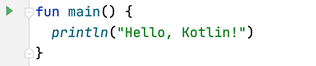
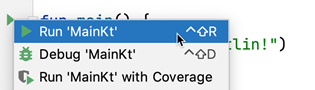

# Atomic Kotlin Examples

- [Introduction](#introduction)
- [Building From the Command Line: Quick Version](#building-from-the-command-line-quick-version)
- [Building From the Command Line: Detailed Instructions](#building-from-the-command-line-detailed-instructions)
  * [Install Java](#install-java)
    + [Windows](#windows)
    + [Macintosh](#macintosh)
    + [Linux](#linux)
  * [Verify Your Installation](#verify-your-installation)
  * [Installing and Running the Book Examples](#installing-and-running-the-book-examples)
- [Using `run`](#using-run)
- [Running Kotlin from the Command Line](#running-kotlin-from-the-command-line)
  * [Install Kotlin](#install-kotlin)
  * [The REPL](#the-repl)
- [Testing](#testing)
- [Compiling and Running Programs in IntelliJ IDEA](#compiling-and-running-programs-in-intellij-idea)
- [Compilers vs. Interpreters](#compilers-vs-interpreters)

# Introduction

These are the code examples from the book [Atomic
Kotlin](https://www.AtomicKotlin.com), created by an automatic extraction
process directly from the book. This repository provides a test of the code
that is shown in the book, to verify that it is correct.

To access and experiment with the book examples, the easiest approach is to
clone/download this repository and open it with IntelliJ IDEA. This is all that
most people need, and those people can ignore the rest of this README.

The remainder of this README shows you how to build and test the examples using
the command line.

Exercises and solutions for the book can be found at [AtomicKotlin.com/exercises](https://www.atomickotlin.com/exercises).

# Building From the Command Line: Quick Version

Before you can run the examples from this repository, you must install the
current version of
[Java](http://www.oracle.com/technetwork/java/javase/downloads/index.html),
although some earlier versions should also work. (If you get any errors, try
upgrading to a more recent version of Java).

If you just want to download and check the code, [Download
Here](https://github.com/BruceEckel/AtomicKotlinExamples/archive/master.zip)
and unzip into your destination directory. Open a shell/command window and
move into the root of that directory. You'll know you are in the right
directory if you see the files `gradlew` and `gradlew.bat`.

On Mac/Linux, enter:

```
./gradlew test
```

(If you get a *Permission denied* error, run `chmod +x ./gradlew`)

On Windows, enter

```
gradlew test
```

You'll need an Internet connection the first time you compile the code,
because Gradle needs to first install itself, then all the support libraries.
Once these are installed you can perform additional compiling and running
offline.

If all goes well, the tests will run. Everything should complete without errors.

All the book examples are in the subdirectory `Examples` in subdirectories
corresponding to the atom names.

To compile and run examples using the Kotlin command-line tools, see
[Command-Line Hello World](https://github.com/BruceEckel/AtomicKotlinExamples/blob/master/Command_Line_Hello_World.md).

# Building From the Command Line: Detailed Instructions

If you are not familiar with the command line, first read [Command-Line
Basics](https://github.com/BruceEckel/AtomicKotlinExamples/blob/master/Command_Line_Basics.md).

## Install Java

Kotlin runs on top of Java, so you must first install Java (you only need basic
Java; the development kit also works but is not required).

### Windows

1. Follow the instructions at this link to [Install Chocolatey](https://chocolatey.org/).

2. At a shell prompt, type: `choco install jdk8` (you may also select a more
recent version, like jdk11). The installation process takes some time, but when
it's finished Java is installed and the necessary environment variables are
set.

### Macintosh

The Mac comes with a much older version of Java that won't work for the
examples in this book, so you'll need to update it to (at least) Java 8.

  1.  Follow the instructions at this link to [Install HomeBrew](http://brew.sh/)

  2.  At a shell prompt, first type `brew update`. When that completes, enter
      `brew cask install java`.

**NOTE:** Sometimes the default version of Java that you get with the above
installation will be too recent and not validated by the Mac's security
system. If this happens you'll either need to turn off the security by hand
or install an earlier version of Java. For either choice, you'll need to Google
for answers on how to solve the problem (often the easiest approach is to just
search for the error message produced by the Mac).

### Linux

Use the standard package installer with the following shell commands:

*Ubuntu/Debian*:

  1. `sudo apt-get update`

  2. `sudo apt-get install default-jdk`

*Fedora/Redhat*:

```
su -c "yum install java-1.8.0-openjdk"
```

## Verify Your Installation

Open a new shell and type:

```
java -version
```

You should see something like the following (Version numbers and actual text
will vary):

```
java version "10.0.2" 2018-07-17
Java(TM) SE Runtime Environment 18.3 (build 10.0.2+13)
Java HotSpot(TM) 64-Bit Server VM 18.3 (build 10.0.2+13, mixed mode)
```

If you see a message that the command is not found or not recognized, review
the installation instructions. If you still can't get it to work, check
[StackOverflow](http://stackoverflow.com/search?q=installing+java).

## Installing and Running the Book Examples

Once you have Java installed, the process to install and run the book examples
is the same for all platforms:

1. Download the book examples from the
[GitHub Repository](https://github.com/BruceEckel/AtomicKotlinExamples/archive/master.zip).

2. `unzip` the downloaded file into the directory of your choice.

3. Use the Windows Explorer, the Mac Finder, or Nautilus or equivalent on Linux
to browse to the directory where you uzipped `AtomicKotlinExamples`, and open a
shell there.

4. If you're in the right directory, you should see files named `gradlew` and
`gradlew.bat` in that directory, along with numerous other files and
directories. The directories correspond to the chapters in the book.

5. At the shell prompt, type `gradlew run` (Windows) or `./gradlew run`
(Mac/Linux).

The first time you do this, Gradle will install itself and numerous other
packages, so it will take some time. After everything is installed, subsequent
builds and runs will be much faster.

Note that you must be connected to the Internet the first time you run `gradlew`
so that Gradle can download the necessary packages.

# Using `run`

In each atom-named subdirectory under the `Examples` directory, you will see
two files: `run.bat` and `run.sh`. These are convenience commands for Windows
and Mac/Linux that allow you to compile and run the examples in that
subdirectory. They are not necessary to build the code, but if you begin
experimenting with individual examples they are helpful.

To run these scripts, you must first install a recent version of
[Python 3](https://www.python.org/downloads/).

If you just type `run` (`./run.sh` in Mac/Linux), it will (using
Gradle) compile and run all the examples in the directory. You can also type
`run AnExample.kt` to compile and run the example `AnExample.kt` (assuming it
has a `main()`).

If you get a *Permission denied* error on OSX or Linux, run `chmod +x ./run.sh`

# Running Kotlin from the Command Line

The Kotlin interpreter is also called the REPL (for *Read-Evaluate-Print-
Loop*). To use this you must first install the
latest version (1.4 or higher) of the [Kotlin command-line
compiler](http://kotlinlang.org/docs/tutorials/command-line.html).

> NOTE: You do not need to install command-line Kotlin for the operations
> described previously in this README.

## Install Kotlin

In this book, we use Kotlin version 1.4, the latest available at the time. The
detailed installation instructions for the command-line compiler are available
at [The Kotlin Site](https://kotlinlang.org/docs/tutorials/command-line.html).

To check your installation, open a new shell and type:

```
kotlin -version
```

at the shell prompt. You'll see the version information for your Kotlin
installation.

## The REPL

You get the REPL when you type `kotlinc` by itself on the command line. You
should see something like the following:

```
Welcome to Kotlin version 1.4 (JRE 1.8.0_144-b01)
Type :help for help, :quit for quit
>>>
```

The exact version numbers will vary depending on the versions of Kotlin
and Java you've installed, but make sure that you're running Kotlin 1.4
or greater.

The REPL gives you immediate interactive feedback, which is helpful for
experimentation. For example, you can do arithmetic:

```
>>> 42 * 11.3
474.6
```

Find out more by typing `:help` at the Kotlin prompt. To exit the REPL,
type:

```
>>> :quit
```

To compile and run examples using the Kotlin command-line tools, see
[Command-Line Hello World](https://github.com/BruceEckel/AtomicKotlinExamples/blob/master/Command_Line_Hello_World.md).

# Testing

The test system is built in so that we (the authors) can verify the correctness
of what goes into the book. You don't need to run the tests, but if you want
to:

1. `gradlew GenerateTests` generates tests from the sources in this repository.
   It creates (or recreates) the file `TestExamples.java`. You normally don't need to run this; the
   `TestExamples.java` in the repository should be up to date.

2. `gradlew TestExamples` runs the tests in `TestExamples.java`.

Alternatively, `TestExamples.java` can be called as a regular **JUnit** test class.

# Compiling and Running Programs in IntelliJ IDEA

To run an example from the book in IntelliJ IDEA, your code will look like
this:



Click on the green triangle in the gutter area near the class declaration and
select `Run`. It should look like this:



IDE runs your program and shows the resulting output.

# Compilers vs. Interpreters

Kotlin is a *compiled* language rather than an *interpreted* one. The
instructions of an interpreted language are executed directly, while the source
code of a compiled language is converted into an intermediate representation
that runs separately:


IDE simplifies the process for you and makes the intermediate stage invisible.

The main benefit of bytecode is that it can be shipped separately without the
source code. Bytecode is conceptually much closer to the very first programming
languages containing "machine instructions," and it's something that a machine
can run.

At *compile time*, the code is checked by the compiler, and all errors are
reported. IntelliJ IDEA highlights these errors when you type the code, so  you
can quickly see and fix them. If there are no errors, the source code can be
successfully compiled into machine-language instructions, often called
bytecode.

*Run time* is the process of running the program. The result of the compilation
(the specific format depends on the target platform) can run independently,
the source code is not needed for execution.

No program (except a trivial one) can be written without mistakes or errors.
Mistakes make an inseparable part of the development process. Different
languages try hard to minimize the number of possible errors.

We distinguish "compile-time error" and "run-time error". The compile-time
error is an error that happens while you're writing the code, and you can
immediately fix it. The runtime error is an error that only happens when you
run the program. The runtime errors are more expensive to fix; it's always
better and cheaper to fix an error at an early stage.

One of the important Kotlin goals is to catch as many errors as possible during
the compilation time, or in other words, to prevent them from happening later
at runtime.

Kotlin source code can be compiled to different target platforms:

- **JVM**. The source code gets compiled into JVM bytecode (`.class` files),
which can then be run on any Java Virtual Machine (JVM).

- **Android**. Android its own runtime called
[ART](https://source.android.com/devices/tech/dalvik) (the predecessor was
called Dalvik). The Kotlin source code is compiled into *Dalvik Executable Format*
(`.dex` files).

- **JavaScript**, to run inside a web browser.

- **Native Binaries**, to target specific platforms.

This book focuses on the language itself, using JVM as the only target
platform. After you know the language, you can apply Kotlin on different
application and target platforms.
